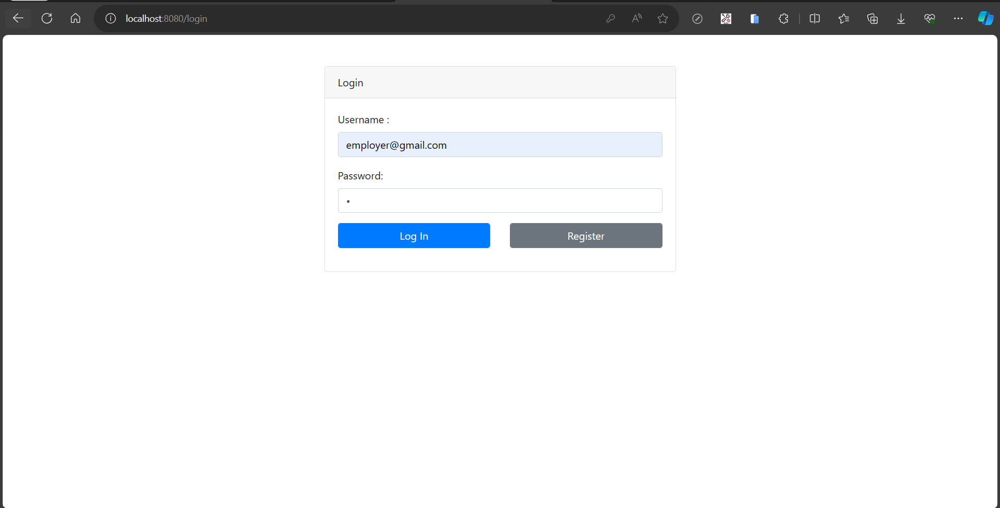
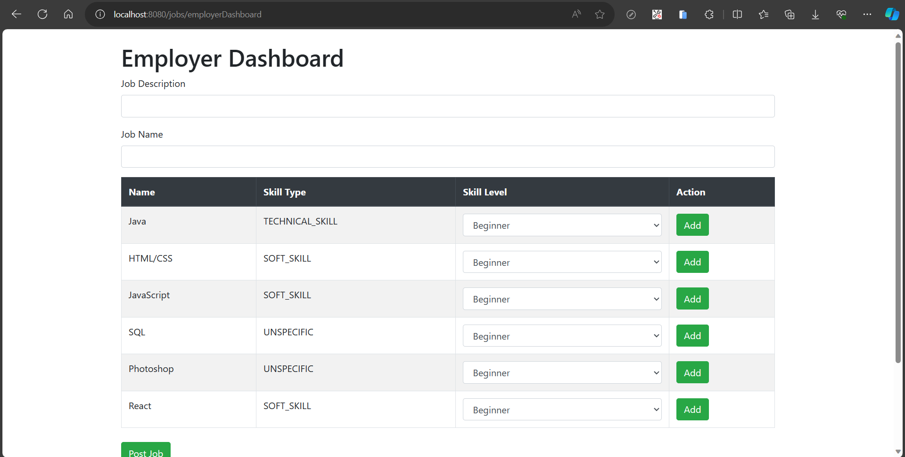
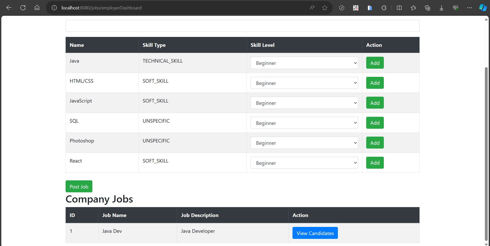
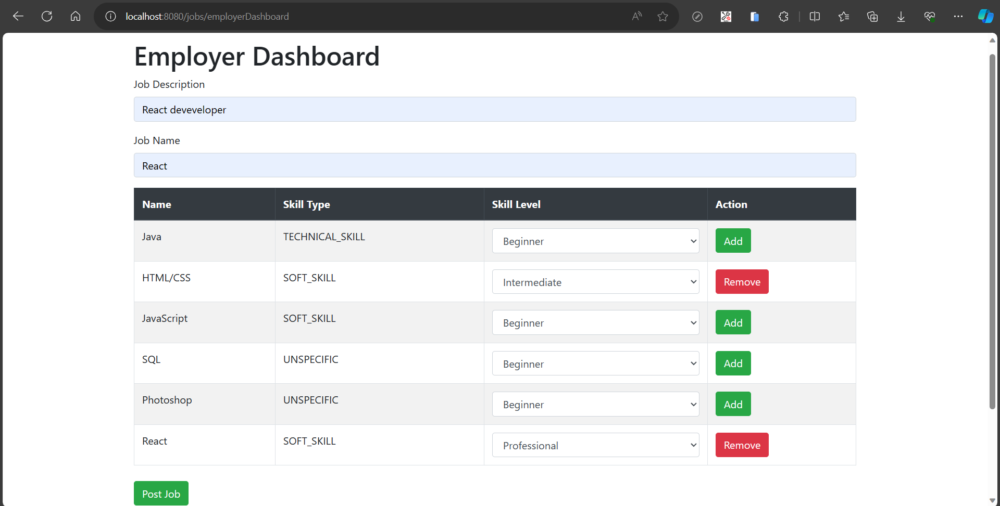
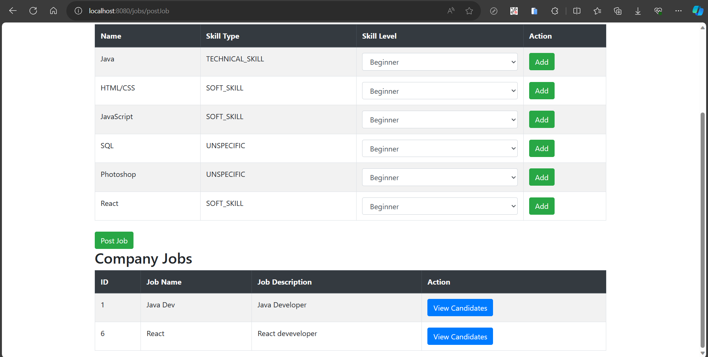
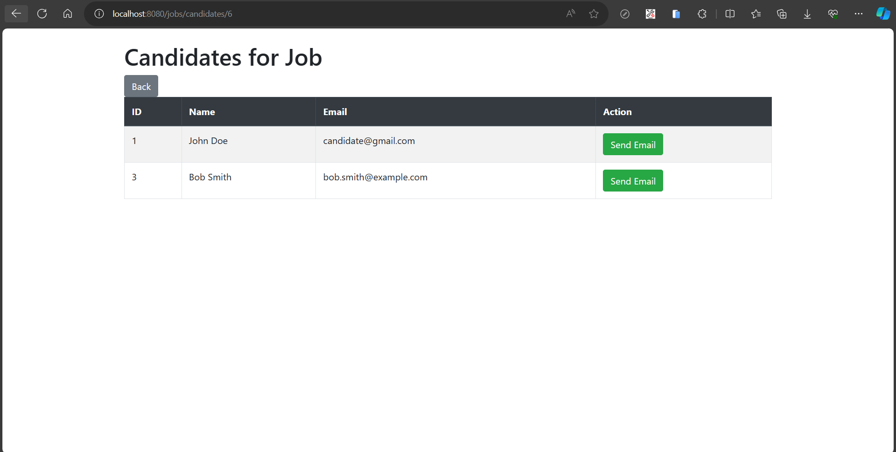
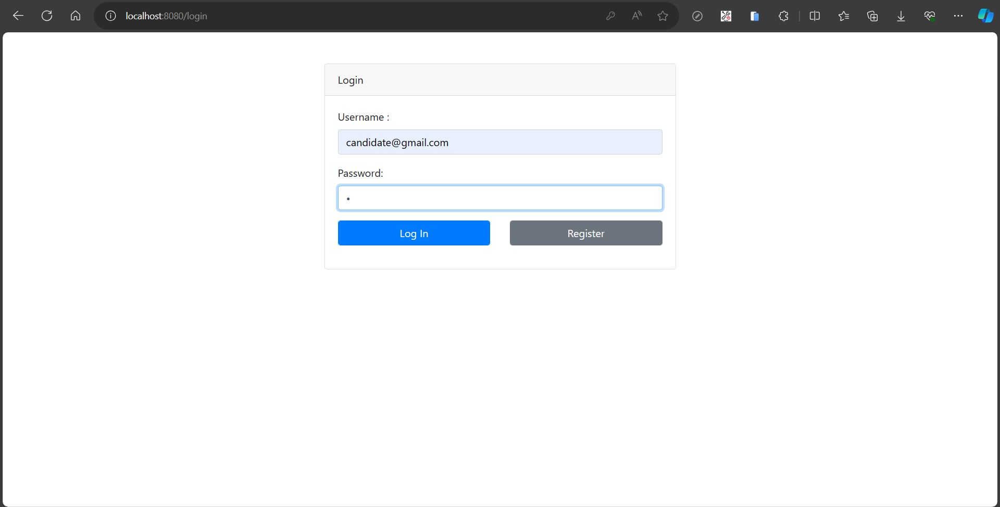
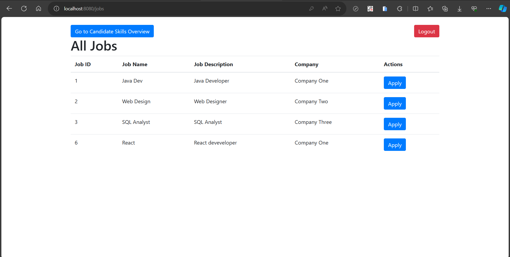
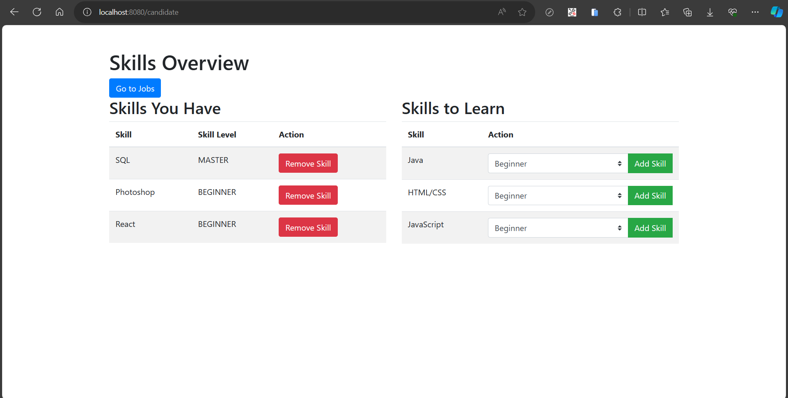
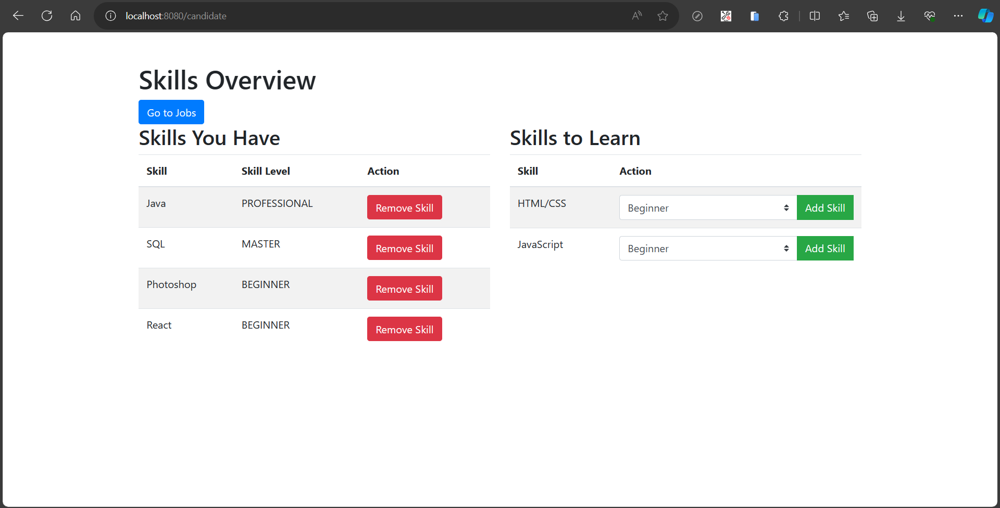

# Web Application Overview

## Employer Login

## Employer Dashboard
### Top Section

### Bottom Section

## Adding a New Job
1. Click on "Add New Job" to open the job creation screen.
   

2. Fill in the job details, including job name, job description, and select skills.
   

## Viewing Candidates for a Job
Clicking on the "View Candidates" button for a specific job will show candidates with matching skills.

## Candidate Login

## Candidate After Login Screen

## Candidate Skill Overview
Viewing current skills and skills to learn.

## Adding a Skill as a Candidate
1. Click on the skill to learn.
   

2. Choose the skill level and click "Add Skill."

---